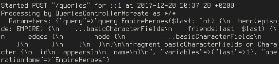
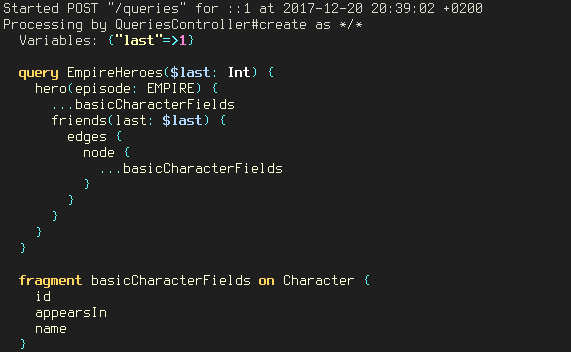

<p align="center">
  <a href="https://github.com/jetruby/graphql-rails_logger">
    
  </a>
  <br />
  <code>GraphQL::RailsLogger</code> allows you to inspect GraphQL queries<br/> in a more readable format.
  <br/><br/>
  <a href="https://badge.fury.io/rb/graphql-rails_logger"></a>
</p>

##### Without `GraphQL::RailsLogger` your query in terminal will look difficult to read:



##### With `GraphQL::RailsLogger` it will look more readable:



## Installation

Add this line to your application's Gemfile:

```ruby
gem 'graphql-rails_logger'
```

And run this command in your terminal:

    $ bundle

## Configuration

By default this gem formats params only for `GraphqlController#execute`.

If you want to change this behaviour, add `config/initializers/graphql_rails_logger.rb` file and set proper controller and actions like this:

```ruby
GraphQL::RailsLogger.configure do |config|
  config.white_list = {
    'QueriesController' => %w(create)
  }
end
```

There is an option to suppress (hide) the GraphQL Introspection Query from the console output. This may be helpful to declutter the console during client testing as these can be rather lengthy.

```ruby
GraphQL::RailsLogger.configure do |config|
  config.skip_introspection_query = true
end
```

The theme can be configured as well.  The theme is applied using the [rouge](https://github.com/jneen/rouge) gem, where all available options can be found.  The default value is `Rouge::Themes::ThankfulEyes.new`.

```ruby
GraphQL::RailsLogger.configure do |config|
  config.theme = Rouge::Themes::Pastie.new
end
```

## Contributing

Bug reports and pull requests are welcome on GitHub at https://github.com/jetruby/graphql-rails_logger. This project is intended to be a safe, welcoming space for collaboration, and contributors are expected to adhere to the [Contributor Covenant](http://contributor-covenant.org) code of conduct. Steps for contributing:

  1. Fork it
  2. Create your feature branch (`git checkout -b my-feature`)
  3. Commit your changes (`git commit -am 'Add feature'`)
  4. Push to the branch (`git push origin my-feature`)
  5. Create a new Pull Request

## License

The gem is available as open source under the terms of the [MIT License](http://opensource.org/licenses/MIT).

## Code of Conduct

Everyone interacting in the `GraphQL::RailsLogger` project’s codebases, issue trackers, chat rooms and mailing lists is expected to follow the [code of conduct](https://github.com/jetruby/graphql-rails_logger/blob/master/CODE_OF_CONDUCT.md).

## About JetRuby

`GraphQL::RailsLogger` is maintained and founded by [JetRuby Agency](https://jetruby.com/).

We love open source software!
See [our projects][portfolio] or
[contact us][contact] to design, develop, and grow your product.

[portfolio]: http://jetruby.com/portfolio/
[contact]: http://jetruby.com/#contactUs
